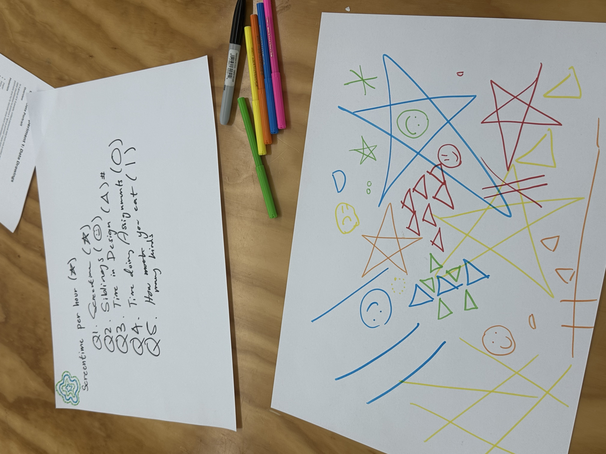
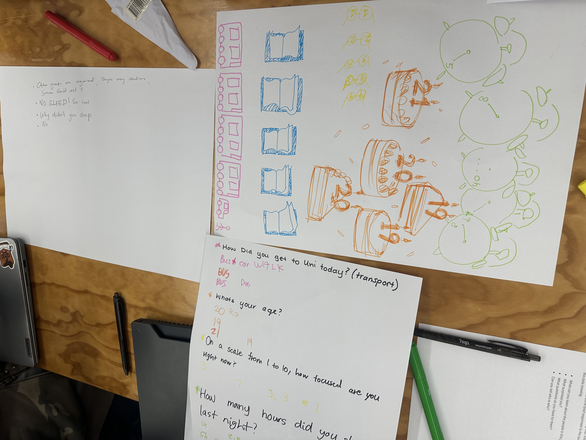
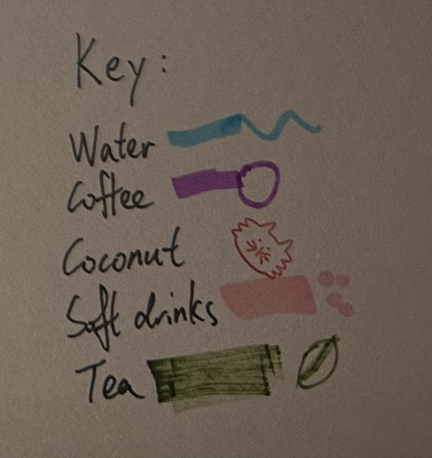

# Week 01

[← Back to Home](../index.md)

## Class Comunications 

### Data and Data Visualisation

*The class contribution about **What is data?***

We discussed about what is Data to start the very fundation knowledge of this course. 

I think data is something visible and can be control or records, such as statstistics or any types of informations. Data is all around us, and recording different types of data can be able to help the designers to know or realised some facts that not always noticed.

Data is been defined as related items of information considered collectively or something known or assumed as fact.

The data can be origin back to 18,000 BC. The bones and rocks are both brual tool or carrier of data.

Datas are digitalised a lot in nowadays. The smartwatch will record the health data, the chat on the softwares are a form of the texts and images.

And datafication is a process that transform the unvisualised things into a visible datasets.

##

### Data as a Creative Material

I saw many examples of the creative visualise the data setting or record data in creative way.

The one that I felt most intersting is the data string from *Domestic Data Streamers*. 

I think this project have deeply interaction with the user and can be able to use in a large population or a large data sets. By using the strings to create the connection between different questions or selection makes the data visible and aesthetic pleasing.

*Carling* is more abstract for me to understand although it have a stronger record attributes. It creates another diamenion ways of visualising the data.

*Lets Play with Data* is more likely an installation art which is placed in public space.

It using a simplest way to record, by using circle stickers the data is visualised by how much sticker is on different sections.

At the same time, it is a playful experience in public space. I think there're some key features that need to be includes while making a project like "*Lets Play with Data*". Which are Eye-catching colors; Trending topics; Fun interactions.

##

### Data Humanism

The video recording of Giorgia Lupi on how to visualizes life through data. I the video, she records the sypthem she have during the Covid-19 during a year.

This experiment or the video notice me that I can use similair way to record something that I haven't always noticed, and this is also a effective way to create a habit of recording my life using a creative and abtract tool.

##

## Group Data Portraits
Step 1: Collect
- As a group, devise a short questionnaire
- Answer individually, record your own answers anonymously

Step 2: Visualise
- Work together to produce a collective data drawing
- Invent your own visual language

In this in class experiment, we use an abstract way to represents the data.

The questions we chose are:
- Average Screen time of the week
- How many siblings do we have?
- How much time do we spend on Design?
- How much time do we spend on Design Assignments?
- How many kind of food do we eat yesterday?

We use very simple shapes to represents different questions. And this cause a lot uncertains. Such as the Screentime question, if the first person have an over average use on screen but draw a very small star. This will make the other people have to draw a smaller to keep the rule and overall diamention of the image. By using this random style of records creates a lot of randomness to the image and hard to tell what is what by just looking at the image. 

Step 3: Decode

- Swap your data drawing with another group
- Work together to write responses:
  - what can you learn about the people in this group?
  - what surprised you?
  - what questions do you have for them?
  - can you tell who is who?

This is absolutly different to what we did, they have a well organised image presenting. They surprised me by the symbol they choose to record. By drawing a realistic image. I have question about what is meaning for the yellow glasses, it's really hard to connect it with the question. And I can not tell who is who because the questions are not connect or really related to each others.

##

## Independent Data Portraits

### Overview
Create your own data portrait: a hand-drawn visualisation of personal data
collected over several days.

### Step 1: Choose a topic

Pick an aspect of your daily life that you are curious about but don't normally pay close attention to. It should be something you can observe and record by hand over the course of 4–5 days.

**I choose to record the kinds and amount of liquids I drink in the week.**

This is because I don't offen drink many water.

### Step 2: Collect data by hand
Carry a small notebook, use the back of a receipt, or whatever is convenient Record your observations as they happen.

Don't rely on apps or digital tools. The act of noticing and writing things down is part of the exercise. 

Be as specific and honest as you can. Include details that feel imperfect, ambiguous, or hard to categorise.

**This is what I record in this week, I have few categories: water, coffee, coconut, tea and soft drinks.**

### Step 3: Design your visualisation
After your collection period, create a data drawing on one side of A4 card.

Invent a personal visual language: use colour, shape, position, pattern, size, and texture to encode different aspects of your data. On the reverse side, draw a
legend that explains your visual system.

### Document and Reflection

What I choose to track is how much liquid and different kind of liquid I have in this week. I choose this is basicly beacuse I think I don't have enough liquid drink everyday and this is something I would like to record for a long time. 

To collecting this data is not that easy, the amount of water I have each time is different, so I keep it as 400ml as a unit which is the size of my cup at home and it's also the normal size if I buy coffee at Starbucks or Bubbletea shop. Collecting this data is also a process that recording my own health. I use different colours and symbols to represents different categories mostly are similise to what it's originally looks like and the coconut I use a stamp to shown, the soft drink use the bubbles to represents the carbon dioaxide.

I notice that I need to drink more water, most of the day I have other drinks more than water. Although coconut and tea are also healthy drinks. If I didn't do this experiment, I will not notice that I actually have a lot soft drinks. This always happened while I have dinner and I bearly notice that I have it often. And from the date of the data collect, I notice that I will always have coffee on the day I need go to school and tea on the day that at home, coconut on the day that I went to work. Also on the weekends, I have more amount of liquid been drink.

This experiment can be related to the humanism by showing my daily rotines and gives me a clear view of informations about my liquid drinking. This could help me to improve my rotine to make it more healther and keep recording to see the change. To known if the change is working also keep records will let me have a think: Am I having too much coffee today? Do I need to have more water?

I think this is a very useful and inspired experiment which gives me a clear idea and knowledge about the data collection and data drawing methods.
