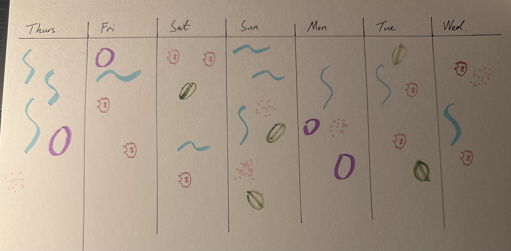

# Week 02

[← Back to Home](../index.md)

## Class Communications

### Interactivity in These Project

The projects shown from the last week is been rediscussed.

- The visualisation changes based on what people do
- Data is collected through the interaction, not just displayed
- The experience of engaging with the data is part of the meaning
- Physical materials and space shape how people encounter information 

##

## Experiment 2 - Interativity

### From Physical to Digital

We will use p5.js to do some data drawings and interactive. It is a JavaScript library designed to make coding accessible for artists, designers and beginners.

I can adds buttons, sliders, input fields, dropdown menus to my drawings. By advanced coding techniques, I can even make some particle effects.

##

### Setting up and learn the basics

I create a p5.js account.

And have a learn about the overview of the interface.


And the next step is to Setup the function, I learned how to create a canvas. by use the function "createCanvas()" and "setup()". And by using the draw function, the "draw()" function continuously executes the lines of code contained inside its block until the program is stopped.

```
function setup() {
  createCanvas(400, 400);
}

function draw() {
  background(220);
}
```


##

### Starting Experiment

The p5.js follow the coordinate space which is the x axis and y axis to represents the position while creating images on canvas.

The first function I tried is to create a circle.

Then I learned how to create comment on the code, which will not shown on the canvas, this is a useful tool to remind myself of what a piece of code does.


```
function setup() {
  createCanvas(400, 400);
}

function draw() {
  background('white'); // set background to white
  fill('red'); // fill shapes with red
  strokeWeight(0); // no outline for shapes
  circle(250,250,50); // circle at (250,250) with a size of 50
}
```


And the programe is run from top to bottom of the code, and one step at a time.

```
function setup() {
  createCanvas(400, 400);
}

function draw() {
  background('white');
  fill('red');
  strokeWeight(0);
  circle(250,250,50);
  fill('blue');
  circle(100,100,50);
}
```

This code will be looking like:


##

### Reference

There's a whole page of reference about the p5.js coding, it explain all the functions and how toi use all these different functions.


We go through some fundamental functions such as circle, fill, StrokeWeight, Background. 

##

### Experimentation


I follow the instruction and use the rectangle, triangle, line and ellipse tool to make the image on the right.

```
function setup() {
  createCanvas(400, 400);
}

function draw() {
  background('rgb(0,0,0)');
  fill('#FFEB3B');
  strokeWeight(0);
  circle(200,250,100);
  fill('#4CAF50');
  rect(0, 250, 400, 200);
  
  stroke('rgb(0,0,0)');
  strokeWeight(1);
  line(0, 250, 400, 250);
}
```


I found that by changing the order of the instruction, the image will change, such as if I type in the code for the green rectangle first then I type the circle. the circle will be on top of the rectangle due to the programme sequence.

I think I didn't perfectly match the image it given, becauser the origin image is not a perfect square and the canvas I create is a perfect square.

##

## Coding funamentals

### Variables

 - Variables are how we store data in our program. 
 - A variable has a name and a value.

We use "**let**" to create one.  
Change the value of size and run the program again.

```
let size = 80;

function setup() {
  createCanvas(400, 400);
}

function draw() {
  background('white');
  fill('red');
  circle(200, 200, size);
}
```


I change the size value from 80 to 200 and the size of the circle is changing.

Because the value named : "size". And it been repalced as "d" which is the diameter of the circle.

##

### Updating Variables

 - The funcrion "draw()" will run 60 times per seconds,

 - Because "draw()" runs over and over, we can change a variable in each frame.

 ```
 let xPos = 0;

function setup() {
  createCanvas(400, 400);
}

function draw() {
  background('white');
  fill('red');
  circle(xPos, 200, 80);
  xPos = xPos + 1;
}
```

[Screen Roacording for this experiement](https://youtu.be/_2tKOkOmvTc)

I change +1 to +5 the circle is moving faster.

**Try updating a variable for the size of the circle.**
  
I follow the movement one and write up this code.

```
let xPos = 0;

function setup() {
 createCanvas(400, 400);
}

function draw() {
 background('white');
 fill('red');
 circle(200, 200, xPos);
 xPos = xPos + 1;
}
```

[Screen Roacording for this experiement](https://youtu.be/qpk22az3HVQ)

The size of the circle is getting larger by the time. And fill the whole canvas at last.

##

### Built-In Variables

 - p5.js has built-in variables that update automatically.
 - mouseX and mouseY store the current position of the mouse on the canvas.

```
function setup() {
  createCanvas(400, 400);
}

function draw() {
  background('white');
  fill('red');
  circle(mouseX, mouseY, 80);
}
```

What happens if you remove the background() line?

[Screen Roacording for this experiement](https://youtu.be/YLqlMCbUn_M)

I remove the background line, and the circle will not be removed and all the circle been draw will be stay on the canvas. This is because the draw is repeated 60 times a sec. The background is under the draw so every time will recreate the background.

##

### Condiutionals

 - A conditional lets your program make decisions.
 - Use if to run code only when something is true.
 - Use else to say what should happen otherwise.
 - The circle changes colour depending on which side of the canvas the mouse is on.

 ```
 let size = 80;

function setup() {
  createCanvas(400, 400);
}

function draw() {
  background('white');
  if (mouseX > 200) {
    fill('red');
  } else {
    fill('blue');
  }
  circle(200, 200, size);
}
```

[Screen Roacording for this experiement](https://youtube.com/shorts/3rkVYw7k1Vc?feature=share)

##

### DOM Elements

DOM stands for Document Object Model.

This is the structure of a webpage: every element on a webpage (headings, images, buttons, inputs) is part of the DOM.

p5.js can create DOM elements — buttons, sliders, text inputs — and connect them to your sketch, so the user can control what happens on the canvas.

These are the digital equivalents of the physical interactions we looked at earlier.

##

### Button

 - create DOM elements inside setup().
 - createButton() adds a clickable button to the page.
 - .mousePressed() tells the button what to do when it is clicked.
 - Here we have written our own function called changeColour. It runs each time the button is pressed.
 - random() picks a random value from an array — a list of items inside [ ] square brackets.

 ```
 let colour = 'red';

function setup() {
  createCanvas(400, 400);
  let button = createButton('change colour');
  button.mousePressed(changeColour);
}

function draw() {
  background('white');
  fill(colour);
  circle(200, 200, 80);
}

function changeColour() {
  colour = random(['red', 'blue', 'green']);
}
 ```

[Screen Roacording for this experiement](https://youtube.com/shorts/Cn2X8Xch5zo?feature=share)

##

### Slider

 - createSlider(min, max, start) adds a slider to the page.
 - The three values (inside the brackets) set the minimum, maximum, and starting position.
 - The slider is stored in a variable declared at the top of the program.
 - .value() returns the slider’s current value.
 - .position(x, y) places a DOM element at a specific location on the page. Without it, elements stack below the canvas.

 ```
 let slider;

function setup() {
  createCanvas(400, 400);
  slider = createSlider(10, 200, 80);
  slider.position(10, 30);
}

function draw() {
  background('white');
  fill('red');
  circle(200, 200, slider.value());
}
 ```

[Screen Roacording for this experiement](https://youtube.com/shorts/FVkM0XP0vpk?feature=share)

##

### Text and Text Input

 - createInput() adds a text field to the page.
 - Here we’ve given it an empty string with '' so the field starts blank.
 - The input is stored in a variable declared at the top of the program.
 - .value() returns whatever the user has typed.
 - text(content, x, y) draws text on the canvas at the given position.
 - textSize() sets how large the text appears.

```
let input;

function setup() {
  createCanvas(400, 400);
  input = createInput('');
  input.position(10, 420);
}

function draw() {
  background('white');
  fill('black');
  textSize(32);
  text(input.value(), 50, 200);
}
```

[Screen Roacording for this experiement](https://youtube.com/shorts/unwQ3XtbohI?feature=share)

## 

### Make an Interactive Sketch

Using what you’ve learned, create a sketch with at least two DOM elements that control something on the canvas.

I create a sketch that includes two DOM elements, one slide bar to control the position of the circle and a text box to control the colour by tyoe in the colour.

```
let slider;
let colorInput;

function setup() {
  createCanvas(400, 200);

  slider = createSlider(0, width, width / 2);
  slider.position(10, height + 10);

  colorInput = createInput('red'); 
  colorInput.position(10, height + 40);
}

function draw() {
  background(220);

  let x = slider.value();
  let c = colorInput.value();

  fill(c);
  ellipse(x, height / 2, 50, 50);
}
```

[Screen Roacording for this experiement](https://youtube.com/shorts/1-IYxFIebBc?feature=share)

##

## Vibe Coding

### Introduction

Vibe coding means building software by describing what you want in natural language, using an LLM to generate the code.

Use an LLM (e.g. Gemini, ChatGPT, Claude) to help you build a more ambitious interactive sketch in p5.js.

 - Describe what you want in plain language.
 - Paste results into the p5.js editor and run the program.
 - Start with something simple, add features one at a time.
 - Ask for something you don’t know how to code, and try to learn from the LLM.
 - Make notes on what surprised you, what worked first time, what didn’t, and what you learned.

 I would like to create a Auckland skyline, at first it just give me image that could not move at all.


And then I ask the Genmini to give me adding motion effect to make it move.

```
let stars = [];
let clouds = [];

function setup() {
  createCanvas(800, 400);
  // Generate static star positions
  for (let i = 0; i < 100; i++) {
    stars.push({ x: random(width), y: random(height * 0.6), size: random(1, 3) });
  }
  // Generate cloud objects
  for (let i = 0; i < 5; i++) {
    clouds.push({ x: random(width), y: random(20, 100), speed: random(0.2, 0.5) });
  }
}

function draw() {
  drawNightSky();
  
  // 1. Moving Clouds
  noStroke();
  fill(100, 100, 150, 40);
  for (let c of clouds) {
    ellipse(c.x, c.y, 100, 30);
    c.x += c.speed;
    if (c.x > width + 50) c.x = -50;
  }

  // 2. Twinkling Stars
  fill(255);
  for (let s of stars) {
    let twinkle = sin(frameCount * 0.05 + s.x) * 50; // Pulsing alpha
    fill(255, 255, 255, 150 + twinkle);
    ellipse(s.x, s.y, s.size);
  }

  drawWater();

  // 3. Buildings with Flickering Lights
  drawBuilding(100, 120, 60); 
  drawBuilding(180, 80, 50);  
  drawSkyTower(300, 300);          
  drawBuilding(380, 100, 70);
  drawBuilding(550, 110, 55);
}

function drawSkyTower(x, y) {
  push();
  translate(x, y);
  fill(20);
  stroke(40);
  rect(-10, -180, 20, 180); // Shaft
  ellipse(0, -140, 60, 15); // Main deck
  
  // Pulsing Beacon at the top
  let pulse = map(sin(frameCount * 0.1), -1, 1, 100, 255);
  stroke(255, 0, 0, pulse);
  strokeWeight(3);
  line(0, -165, 0, -230); // Spire
  pop();
}

function drawBuilding(x, h, w) {
  fill(15);
  noStroke();
  let bY = height - 100 - h;
  rect(x, bY, w, h);
  
  // Flickering Windows
  for (let i = 5; i < w - 10; i += 15) {
    for (let j = 5; j < h - 10; j += 20) {
      // Use noise or random to make lights "blink" occasionally
      if (noise(x, i, j, frameCount * 0.01) > 0.6) {
        fill(255, 220, 100, 200);
        
        rect(x + i, bY + j, 5, 8);
      }
    }
  }
}

function drawWater() {
  fill(5, 10, 25);
  rect(0, height - 100, width, 100);
  
  // 4. Shimmering Ripples
  strokeWeight(1);
  for (let i = 0; i < 30; i++) {
    let x = (noise(i, frameCount * 0.01) * width);
    let y = map(i, 0, 30, height - 90, height - 10);
    let w = noise(i, frameCount * 0.02) * 40;
    stroke(60, 80, 150, 150);
    line(x, y, x + w, y);
  }
}

function drawNightSky() {
  for (let y = 0; y < height; y++) {
    let inter = map(y, 0, height, 0, 1);
    let c = lerpColor(color(5, 5, 15), color(20, 30, 60), inter);
    stroke(c);
    line(0, y, width, y);
  }
}
```
[Screen Roacording for this experiement](https://youtu.be/oR-XTJImIk4)

## 

## Independent Study: Week Two

### Overview

Take the data you collected for Experiment 1 and use it as the basis for an interactive p5.js sketch. The challenge is to translate your hand-drawn data portrait into something a viewer can explore, control, or manipulate through interactive elements.

##

### Step 1: Translate your data drawing into code

Look at the data you collected by hand last week. How could you represent it in a p5.js sketch? Think about which values are numeric, which are categories, and which are qualitative or hard to pin down.

You don't need to represent everything. Choose aspects of your data drawing that are most interesting to make interactive.




The amount of different types of liquid I drink is the numeric, and th types are the categories, the showing of the image is hard to pin down.

##

### Step 2: Design your interactive visualisation

Create a p5.js sketch that includes interactive elements that allow the viewer to explore your data. Use DOM elements (e.g. buttons, sliders, text inputs, dropdowns, checkboxes) to give the viewer control over what they encounter.

Consider:

 - What can interaction reveal that your hand-drawn portrait could not?
 - How do your controls relate to the structure of your data?
 - What happens when the viewer changes something? Is the response immediate, gradual, surprising?

This is a bit hard to make the interation with the user, So I decide to make it can choose to see a specific type of drink, and for the user to adjustice the symbol size.

I chould not figure out how to make this out by myself so I ask ChatGPT to help me generate this code.


It was a suprise that the symbol for softdrink is a moving image and when the mouse move on to the different colume, the infos on the bottom left will change due to the position.

##

### Step 3: Iterate

Test your sketch. Show it to someone else and observe how they use it. Refine the interaction based on what you observe.

But the text position is not at a perfect position, so I change it by myself in the p5.js.

This is the code after finalising

```
// ----- DATA (based on your handwritten tracking) -----
let data = {
  "Thurs": { water: 3, coffee: 1, coconut: 0, soft: 1, tea: 0 },
  "Fri":   { water: 1, coffee: 1, coconut: 2, soft: 0, tea: 0 },
  "Sat":   { water: 1, coffee: 0, coconut: 3, soft: 0, tea: 1 },
  "Sun":   { water: 3, coffee: 0, coconut: 0, soft: 2, tea: 2 },
  "Mon":   { water: 1, coffee: 2, coconut: 0, soft: 1, tea: 0 },
  "Tue":   { water: 1, coffee: 0, coconut: 2, soft: 0, tea: 2 },
  "Wed":   { water: 1, coffee: 0, coconut: 2, soft: 1, tea: 0 }
};

// ----- UI Elements -----
let drinkSelector;
let sizeSlider;

let days = Object.keys(data);

function setup() {
  createCanvas(900, 450);

  createP("Select drink type to display:");
  drinkSelector = createSelect();
  drinkSelector.option("all");
  drinkSelector.option("water");
  drinkSelector.option("coffee");
  drinkSelector.option("coconut");
  drinkSelector.option("soft");
  drinkSelector.option("tea");

  createP("Symbol Size");
  sizeSlider = createSlider(0.5, 2.5, 1, 0.1);

  textFont("Helvetica");
}

function draw() {
  background(245);

  let cellWidth = width / days.length;
  let symbolScale = sizeSlider.value();
  let hoveredDay = getHoveredDay(mouseX);

  // Draw day columns
  for (let i = 0; i < days.length; i++) {
    let x = i * cellWidth;

    // Hover highlight
    if (hoveredDay === days[i]) {
      fill(255, 240, 210);
      rect(x, 0, cellWidth, height);
    }

    drawDayColumn(days[i], x, cellWidth, symbolScale);
  }

  drawDayLabels(cellWidth);
  drawHoverInfo(hoveredDay);
}

// ----- Hover detection -----
function getHoveredDay(mx) {
  let cellWidth = width / days.length;
  let index = floor(mx / cellWidth);
  return days[index];
}

// ----- Draw symbols for each day -----
function drawDayColumn(day, x, w, scale) {
  let selected = drinkSelector.value();
  let yStart = 80;
  let y = yStart;

  let entry = data[day];

  push();
  translate(x + w / 2, 0);

  // One row per symbol
  for (let drink in entry) {
    if (selected !== "all" && selected !== drink) continue;

    let count = entry[drink];
    for (let i = 0; i < count; i++) {
      drawSymbol(drink, w, y, scale);
      y += 25 * scale;
    }
  }

  pop();
}

// ----- Draw each symbol type -----
function drawSymbol(drink, w, y, s) {
  noFill();
  strokeWeight(3 * s);

  switch (drink) {
    case "water":
      stroke(0, 150, 200);
      drawWiggle(0, y, s);
      break;

    case "coffee":
      stroke(150, 0, 200);
      drawRing(0, y, s);
      break;

    case "coconut":
      stroke(0, 120, 30);
      drawOval(0, y, s);
      break;

    case "soft":
      stroke(255, 120, 150);
      drawDots(0, y, s);
      break;

    case "tea":
      stroke(50, 90, 30);
      drawStrokes(0, y, s);
      break;
  }
}

// ----- Symbol styles (based on your drawing) -----
function drawWiggle(x, y, s) {
  beginShape();
  curveVertex(x - 20 * s, y);
  curveVertex(x - 10 * s, y - 10 * s);
  curveVertex(x + 10 * s, y + 10 * s);
  curveVertex(x + 20 * s, y);
  endShape();
}

function drawRing(x, y, s) {
  ellipse(x, y, 25 * s, 25 * s);
}

function drawOval(x, y, s) {
  ellipse(x, y, 30 * s, 18 * s);
}

function drawDots(x, y, s) {
  for (let i = 0; i < 5; i++) {
    let dx = random(-10, 10) * s;
    let dy = random(-5, 5) * s;
    point(x + dx, y + dy);
  }
}

function drawStrokes(x, y, s) {
  line(x - 15 * s, y, x + 15 * s, y);
}

// ----- Labels -----
function drawDayLabels(cellWidth) {
  textAlign(CENTER);
  textSize(16);
  fill(0);

  for (let i = 0; i < days.length; i++) {
    text(days[i], i * cellWidth + cellWidth / 2, 40);
  }
}

// ----- Hover Info Box -----
function drawHoverInfo(day) {
  if (!day) return;

  fill(0);
  textSize(14);

  let d = data[day];
  let textBlock =
    `${day}\n` +
    `Water: ${d.water}\n` +
    `Coffee: ${d.coffee}\n` +
    `Coconut: ${d.coconut}\n` +
    `Soft drinks: ${d.soft}\n` +
    `Tea: ${d.tea}`;

  text(textBlock, 60, 300);
}
```

[Screen Roacording for this experiement](https://youtu.be/RMkHMvar-dQ)

##

### Reflection

In this experiment, I choose to use all the informations I collected on Experiment 1, because what I made for experiment 1 is more recording and do not have much flexibility for me to make the creative interations. I decide to use the AI to help me brainstorm, it gives me more than I asked. It gives a more completed outcome and plan for the coding, whether the mousemoving to change the show of the data or make the softdrink's symbol live is not been required.

The user could not interact with my hand-drawn data, and it's hard to remember all types of the symbols, but on the code, it have a summery box at the bottom, it gives a more tidy and clear visual expernece for the user.

By using AI to assist with this experiment, I learned how useful it is for a beginner, I think there's few things can be developed more with is data, like adding a conclusion of how much have been drink for different categories and is it over the suggestion or less than suggestion.
