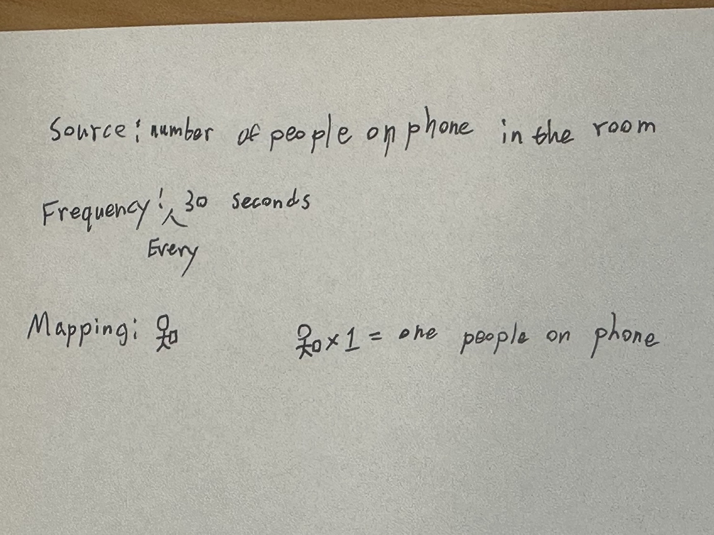
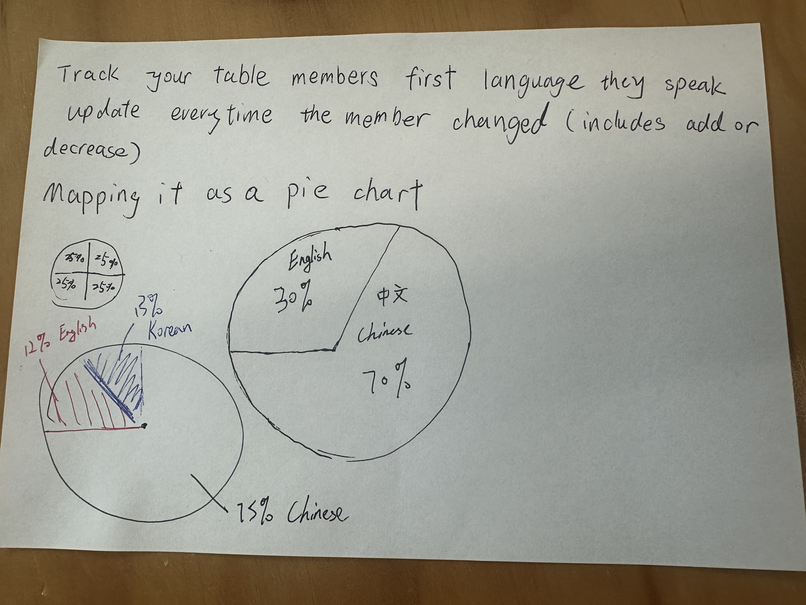

# Week 03

----

[← Back to Home](../index.md)

## Class Communications

----

### Live Data

At the start of the lesson, there're three example of live data:
 - Dangling String (1995)
 - Tele-Present Wind (2024)
 - Listening Post (2002–2005)


**Dangling String** translated live internet traffic data into the physical spinning of a dangling string,it turns the digital bandwidth into ambient mechanical motion.

**Tele-Present Wind** make live wind data from the perseverance rover on Mars directly to mechanical devices on Earth, it causing dried grass stalks to sway in real-time Martian weather.

**Listening Post** pulls live text data from thousands of simultaneous online chat rooms, projecting them across hundreds of small screens and reading them aloud with a voice synthesizer.

The three example give me a brief idea about what is live data, and how can I presents the live data. I see a fascinating push to pull data out of the abstract digital world and ground it in our physical reality. These examples shows that data can be a living, breathing thing. By translating live information into movement, sound, and physical form.

----

### Asking the Internet Questions

_How would you use the Internet to find out the weather, the definition of a word, or the schedule for your bus home?_

This is always process by App and software from mobile phone and it required internet connection.

### The Command Line

The command line (or terminal) is a text-based interface for communicating with your computer.

Instead of clicking on icons and buttons, you type instructions.

Some things can do with the command line:
 - Navigate files and folders
 - Create and edit plain text files
 - Send emails
 - Run programs
 - **Ask the internet for data**

----

### Navigating Files & Folders


----

### Creating a File


[Screen Roacording for this experiement](https://youtu.be/zpD65meMbOA)


----

### Demo 1: ASCII Animations


[Screen Roacording for this experiement](https://youtu.be/Gtfxx3xwggs)

----

### Demo 2: Weather


[Screen Roacording for this experiement](https://youtu.be/zRek5wLfmZk)

----

### Demo 3: Filtering Live Data


[Screen Roacording for this experiement](https://youtu.be/giS21bq3QTc)

----

### Demo 4: Raw Data (JSON)


----

### Explore with curl

Using your terminal and the GitHub repos for wttr.in and the Free Dictionary API, try to figure out how to:

 - Get the weather for a location using its GPS coordinates


 - Get the weather in a different language


 - Get the current moon phase


 - Look up the synonyms and antonyms of a word


Didn't get it.

----

### Application Programming Interface (API)

_**What is an API?**_

An API is a structured way for programs to communicate and exchange data.

When you used curl with wttr.in, you were already using an API: you sent a request to a URL and got data back.

Instead of reading the response in a terminal, the code can read it and do something with it.

----

### Using an API in p5.js

In p5.js, loadJSON() fetches data from a URL, just like curl but inside your sketch.

 - The URL is stored in a variable so it can be reused
 - loadJSON() runs in preload() so the data is ready before the sketch starts
 - The JSON response is stored in the weather object
 - Individual data points are accessed using dot notation, e.g. weather.current.temperature_2m
 - These values are stored in variables (temp, wind, humidity) and used to control visual properties

```
let weather;
let url = "https://api.open-meteo.com/v1/forecast?latitude=-36.85&longitude=174.76&current=temperature_2m,wind_speed_10m,relative_humidity_2m";

function preload() {
  weather = loadJSON(url);
}

function setup() {
  createCanvas(400, 400);
  print(weather.current.temperature_2m);
  print(weather.current.wind_speed_10m);
  print(weather.current.relative_humidity_2m);
}

function draw() {
  let temp = weather.current.temperature_2m;
  let wind = weather.current.wind_speed_10m;
  let humidity = weather.current.relative_humidity_2m;
  
  background(humidity, 100, 200);
  fill('white');
  circle(200, 200, 23.5 * 10);
  fill('red');
  rect(0, 350, wind * 20, 50);
}
```


This is what I get paste the code into p5.js

----

### Drawing with Weather


```
let weather;
let url = "https://api.open-meteo.com/v1/forecast?latitude=-36.85&longitude=174.76&current=temperature_2m,wind_speed_10m,relative_humidity_2m";

function preload() {
  weather = loadJSON(url);
}

function setup() {
  createCanvas(400, 400);
  print(weather.current.temperature_2m);
  print(weather.current.wind_speed_10m);
  print(weather.current.relative_humidity_2m);
}

function draw() {
  let temp = weather.current.temperature_2m;
  let wind = weather.current.wind_speed_10m;
  let humidity = weather.current.relative_humidity_2m;
  
  background(humidity, 100, 200);
  fill('white');
  circle(200, 200, 23.5 * 10);
  fill('red');
  rect(0, 350, wind * 20, 50);
}
```

I got the same image drawing out, and I notice there's a console at the bottom of the coding section.


----

### Using the Console


Now I understand what the shapes are meaning, the higher the tempureture is the larger the circle will be. This can make the user easier see the relations between the different informations.

----

### Live Updates

The weather sketch fetches data once in the preload() function.

Some data moves fast…

The International Space Station orbits Earth at ~28,000 km/h. Its position changes every second.


These two screenshots are only in 10seconds and some of the informations are change.

----

### ISS Tracker

This sketch calls the API every 5 seconds and updates a dot and text on the canvas.

 - setInterval() calls fetchISS() on a timer
 - loadJSON() takes a callback — a function that runs when the data arrives
 - The ISS position is used directly to move the dot
 - We need the if conditional statement to check the data has been received

```
let issData;

let issData;

function fetchISS() {
  let url = "https://api.wheretheiss.at"
    + "/v1/satellites/25544";
  loadJSON(url, function(data) {
    issData = data;
  });
}

function setup() {
  createCanvas(400, 400);
  fetchISS();
  setInterval(fetchISS, 5000);
}

function draw() {
  background(0);
  if (issData) {
    fill('red');
    circle(200 + issData.longitude, 200 - issData.latitude, 20);
    text("Lat: " + issData.latitude, 10, 20);
    text("Lon: " + issData.longitude, 10, 40);
  }
}
```


And this information of Lat and Lon is also keep changing.

----

### Simulating Live Data


### Weather Visualisation

Open the weather sketch in the p5.js web editor and experiment with how you map the data to visual forms.

Some things to try:

 - Change the location (latitude and longitude)
 - Use the data to control different visual properties: colour, position, size, number of shapes
 - Add more weather variables from the Open-Meteo docs to your API URL
 - Use random() or noise() alongside or instead of the live data
 - Use vibe coding to try something more ambitious

 ```
let weather;
// 1. Changed location to Tokyo (Lat: 35.68, Long: 139.76) 
// 3. Added 'cloud_cover' to the API URL
let url = "https://api.open-meteo.com/v1/forecast?latitude=35.68&longitude=139.76&current=temperature_2m,wind_speed_10m,relative_humidity_2m,cloud_cover";

let noiseOffset = 0;

function preload() {
  weather = loadJSON(url);
}

function setup() {
  createCanvas(400, 400);
  
  // Quick check in the console to see the data
  console.log("Temp:", weather.current.temperature_2m);
  console.log("Wind:", weather.current.wind_speed_10m);
  console.log("Humidity:", weather.current.relative_humidity_2m);
  console.log("Cloud Cover:", weather.current.cloud_cover);
}

function draw() {
  let temp = weather.current.temperature_2m;
  let wind = weather.current.wind_speed_10m;
  let humidity = weather.current.relative_humidity_2m;
  let clouds = weather.current.cloud_cover; // New variable!
  
  // 2. Control visual properties: Background mapped to humidity
  // Map humidity (0-100) to a scale of dark blue to bright blue
  let bgBlue = map(humidity, 0, 100, 50, 255);
  background(10, 30, bgBlue);
  
  // 4. Use noise() alongside live data to make a dynamic "sun"
  // The size is controlled by live temperature, but it vibrates with noise
  let baseSize = map(temp, -10, 40, 50, 200); // Maps temp to a reasonable size
  let sunSize = baseSize + noise(noiseOffset) * 30; 
  noiseOffset += 0.05; // Drives the noise forward
  
  noStroke();
  fill(255, 204, 0);
  circle(width / 2, height / 2, sunSize);
  
  // 2. Control number of shapes using cloud cover data
  // Draws small white circles based on the current cloud percentage
  fill(255, 255, 255, 150); // Semi-transparent white
  let numberOfClouds = floor(map(clouds, 0, 100, 0, 50));
  
  for (let i = 0; i < numberOfClouds; i++) {
    // We use random seeds or set positions so they don't flicker wildly every frame
    randomSeed(i); 
    let cx = random(width);
    let cy = random(0, height / 2);
    let cSize = random(20, 60);
    circle(cx, cy, cSize);
  }
  
  // 2. Control position and size with wind speed
  // A ground bar that gets taller and changes color based on wind
  let windHeight = map(wind, 0, 50, 10, 150);
  let redTone = map(wind, 0, 50, 100, 255);
  fill(redTone, 50, 50);
  rect(0, height - windHeight, width, windHeight);
  
  // Text readout
  fill(255);
  textSize(14);
  text(`Temp: ${temp}°C`, 20, 30);
  text(`Wind: ${wind} km/h`, 20, 50);
  text(`Clouds: ${clouds}%`, 20, 70);
}
 ```

[Screen Roacording for this experiement](https://youtube.com/shorts/-oFfIsCLvn0?feature=share)

In this step I try few time and I keep outputting error and, I use Genmini to help me with fixing the bug and I asked to give me a code that can involve all the change.

I think the vibe code is a powerful tool, it always give something surprised me and have a very high efficiency without any error with the code.

----

### Analogue Tools & Techniques

----

### Generative art

From few example shown of generative art, I'm a bit confuesed

Generative art refers to any art practice in which the artist cedes control to a system with functional autonomy that contributes to, or results in, a completed work of art.

The difinition above is said by Philip Galanter, this clearly explained what is generative art. It means given the code or the system a rights or the power to think and create by it's self, similair to the generative intellengence in nowadays.

----

### Conditional Design

 - Design method formulated by the graphic designers Luna Maurer, Jonathan Puckey, Roel Wouters and the artist Edo Paulus
 - Cooperation within a ‘regulated’ process towards an unpredictable design or result
 - Plays with chance, structured frameworks, and generative systems

The **process** is the product.

 - The most important aspects of a process are time, relationship and change.
 - The process produces formations rather than forms.
 - We search for unexpected but correlative, emergent patterns.
 - Even though a process has the appearance of objectivity, we realize the fact that it stems from subjective intentions.

**Logic** is our tool.

 - Logic is our method for accentuating the ungraspable.
 - A clear and logical setting emphasizes that which does not seem to fit within it.
 - We use logic to design the conditions through which the process can take place.
 - Design conditions using intelligible rules.
 - Avoid arbitrary randomness. Difference should have a reason.
 - Use rules as constraints. Constraints sharpen the perspective on the process and stimulate play within the limitations.

The **input** is our material.

 - Input engages logic and activates and influences the process.
 - Input should come from our external and complex environment: nature, society and its human interactions.

My own understand about the Conditional Design is basically design under rules but keep the creativety and randomness tot he outcome. Such as the "3D Straw Structure" the limitation is the amount of the straw and do it one by one. But the creeativity and the ramdomness is still there which is where the straw will be going next or will the structure stand.

----

### Data Protocols

In pairs, design a data protocol: a set of rules for translating a live data source.

Your protocol must specify:

 - Source: what live data to observe (e.g. sounds in the room, a live transport tracker on your phone)
 - Frequency: how often to check (e.g. every 10 seconds, every minute)
 - Mapping: how to record observations (e.g. marks, shapes, actions)

Write your protocol as a clear set of written instructions on a sheet of paper. Someone else in this room should be able to follow your instructions and produce an outcome over a short period of time.



What we made is:

 - Source: number of people on phone in the room
 - Frequency: record every 30 seconds
 - Mapping: draw a stickman on phone

_**In my opinion we didn't make the mapping well, the stickmans is a simple but still complex if the data group is large especially the source is in the whole room.**_

Swap your protocol with another pair.

Follow their instructions without asking questions. Just interpret the rules as written.



We are confused when we get this information, and we ask the group that make this up. They said the source is the languague that been spoken. I don't think this is a great frequency, everytime a member change doesn't means that every one is keep talking. Or if I have both chinese and english in one sentence, how should I record it.

There's not any surprised in this result. The only suprise might be I though my group memebr is chinese for the whole year and now I know they are korean.

----

## Independent Study - Week 3

----

Independent Study: Live Data Visualisation
Overview

Building on the in-class activities, create a work that engages with live data (data that is ongoing and changing). You can either take a digital approach, or an analogue/physical approach.

Option A: Digital

Build a p5.js sketch that responds to live data.

Use an API to bring external data into your sketch. The Open-Meteo APILinks to an external site. (weather) and the ISS Location APILinks to an external site. (International Space Station position) are good examples, as both are free and require no account or API key. However, for this task you must find your own API to work with.

Consider:

How do you map data values to visual properties (colour, size, position, shape, movement)?
What does the visualisation reveal about the data that numbers alone cannot?
How does the sketch change over time? What is the relationship between the data's rhythm and the visual rhythm?

Use the p5.js referenceLinks to an external site. and tutorialsLinks to an external site. to learn new techniques. You could also use LLMs to help you build features beyond what was covered in class. Make sure to document your process and explain what you learn.

----

I choose option A to do this Live Data Experiment

While I make this experiment I was viewing RedNote on my phone and I view a video telling about the bitcoins. And I ask the Genmini if this would be a good choice for the requirments.

The CoinDesk Bitcoin API provides an accessible, public feed of real-time financial data without requiring complex account setups or API keys. Because cryptocurrency markets are highly volatile and never close, this specific stream provides a constantly shifting, high-frequency data set that is ideal for driving dynamic visual movement in a live p5.js sketch.

Because I keep struggleing with the code writing, so I still asked for help to Genmini. 

The first version of code I gives me and the preview is keep loading. And then I asked about the issue, it gives me a simple version but keep the same function.

```
let financeData;
// New, highly reliable API URL for Bitcoin price in USD
let url = "https://api.coingecko.com/api/v3/simple/price?ids=bitcoin&vs_currencies=usd";
let animatedSize = 0;

function preload() {
  // This will pull the live data before the sketch begins
  financeData = loadJSON(url);
}

function setup() {
  createCanvas(400, 400);
  
  // Let's look at the console to see the new structure!
  console.log(financeData);
}

function draw() {
  background(20, 24, 35);
  
  // CoinGecko's structure is much simpler: financeData.bitcoin.usd
  let btcPrice = financeData.bitcoin.usd;
  
  // Let's map a huge price number down to canvas pixels
  // Assuming Bitcoin stays roughly between $40k and $100k
  let mappedDiameter = map(btcPrice, 40000, 100000, 50, 300);
  
  // Smoothly animate to that size so it's not a static jump
  animatedSize = lerp(animatedSize, mappedDiameter, 0.05);
  
  // Visual output
  noStroke();
  fill(255, 153, 0, 150); // Bitcoin Orange with some transparency
  circle(width / 2, height / 2, animatedSize);
  
  // Text readout
  fill(255);
  textAlign(CENTER);
  textSize(16);
  text(`Live BTC (USD): $${btcPrice}`, width / 2, height - 30);
}
```


[Screen Roacording for this experiement](https://youtube.com/shorts/TdZlrYN4ZYE?feature=share)

I took a digital approach, using the CoinGecko API to track the live price of Bitcoin, since the internet felt like the best place to capture such fast-moving data.  I use an LLM helped me smooth out the code and change to a new API when my first choice wouldn't load properly. Through this, I learned how to read raw data structures and turn massive numbers into clean visual elements. Instead of just showing a boring number on a screen. I mapped the price to the size of a central orange circle.  Using a smooth animation trick, the shape gently "breathes" and pulses as the market fluctuates, capturing the restless, collective energy of global traders in real time. Although the final animation is much more gentle as the time I record on the image is not long enough, I believe that as the time adds, the effect will be better shown.

I think this could relate to David Bowen’s Tele-Present Wind from class. While he translated invisible Martian wind into swaying grass, I translated invisible market data into the movement of a digital shape. If I had more time, I would love to add a sound feature that triggers different tones when the market spikes or drops. This experiment taught me that data isn't just numbers on paper. It's a raw material that I can transform into art.