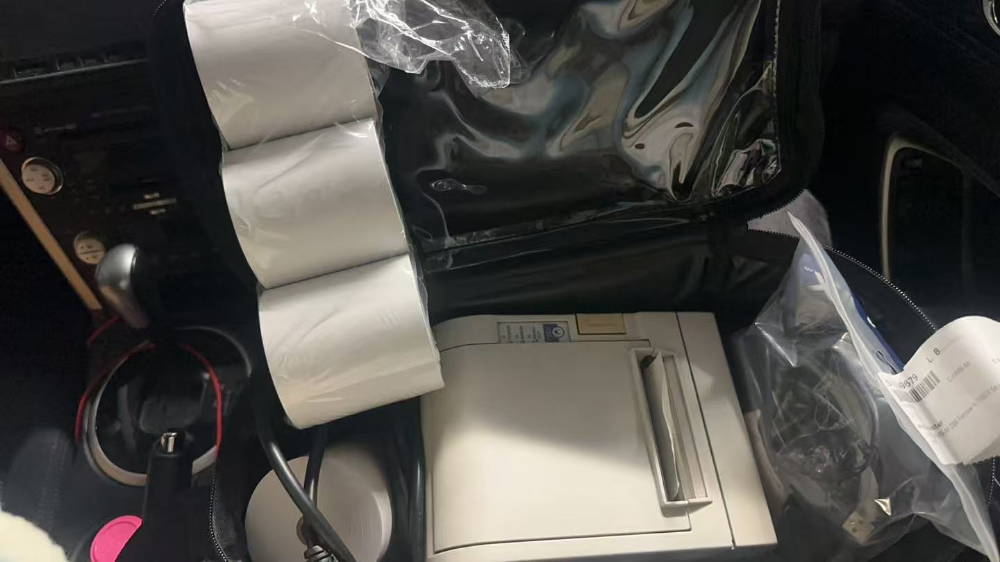
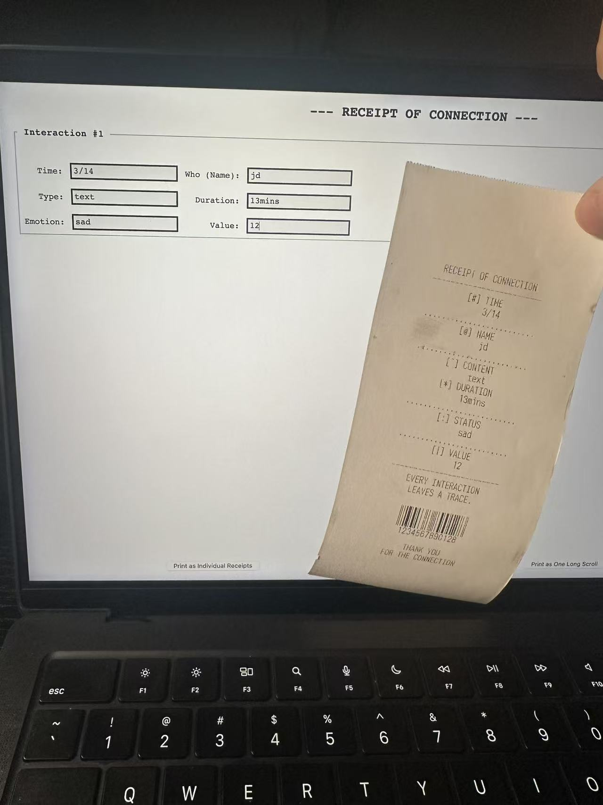
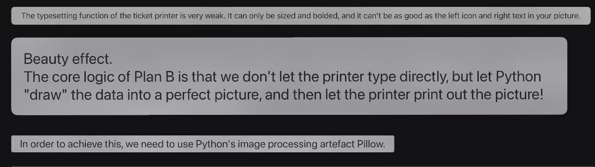
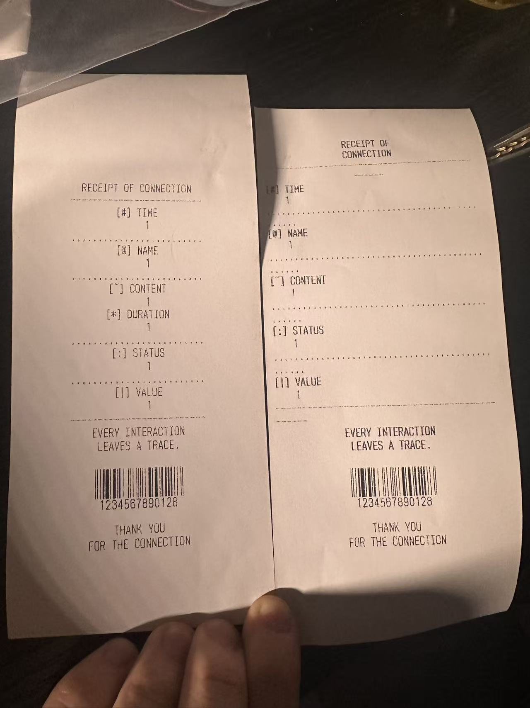

# Week 08

[← Back to Home](../index.md)

## In-Class Activities 

----

### Progress Reports


Here's some note I made for the progress report.


I think the real time printing would be an interesting point that I can be working more on. Having this point connected with continuous recording and printing automatically could be hard to achieve at this point.

But this will need extra consent from the audience about privacy of getting the voice record. But this could developed in a future scenario which by the cecelope of the technology there would be install chips or a smart system within human brains or bodies. There would be some possibility that people can be recongnised what's the true and actural feeling they got ina scientify way or in a biological message that is visible for the computer or as a visible dataset.

And there's a comment on the grand size of the exhibition this might be a hidden risk of missing details in some aspect or hard to do the installation on site, too much different material is required.

This required me to make a detailed floor plan before the installation for the showcase or have a demo before.

----

### Critical Design Propositions

```
Think critically about your partner's work:

- What aspect of their approach is most interesting?

- What is least developed?

- Is there an alternative form (e.g. physical, screen-based, interactive) that could strengthen the work?

- How might their future scenario or intended impact be communicated more powerfully?

- What else would you change or do differently if this were your project?
```

I take brief and feedback for two person.

Yulu's project. Which is a project about the healthy diet and use data visualisation to shown the calories and the health or impact on the person. 


I think her idea on the healthy diet is kind of the most interesting part, because it is a common topic that been mentioned a lot nowadays. And there are so many examples of data visualisation about this topic. I'm really curious about how would she present the idea differently.

The least developed thing for her project would be the format of the showcase and the uncertaincy about the message she would like to developed. Because this project is not only collect a set of data but need to delivered some sort of idea or message to the audience and influence them with a certain interactions. 

So I create a brief idea about how would I design this project if I am the designer and have been given this certain topic.

I will keep the methods about their way of collecting the data and I will choose to make the show case a digital or screen based. This will required a python or any other type of code designing to make a software.

And the interaction or change for this would be, firstly create a brand new data set which include most of the food we will have normally to proceed the next interactions. By recording the audiemnce's diet or choose the ingredient, shows the meal is healthy or not by the colour. To achieve this, it will need to give a value for different ingredient and have a formula to cauculate the value of the healthness.

For the future scenario of this project, I think it have a protential of adjustice the people's knowlege on the healthy diet as the obesity rate is increasing in the society. The techonolgy could help makiung this into a live data and given feedback to the audience.


This is the project of other person which is about a emotions dairy for her.

The most interesting part for her project is the way of she try to represent the emotion record to the audience. She tries to use a way of Pop-up Book as the final outcome. I think it would be interesting but have some issues with the connection with the audience.

I give a few suggestion on change the length of recording her dataset, 4 weeks is kind of too long for this project. A shorter collecting period could help speeds up the iteration and leave time for the adjustice on the final outcome.

And there's a issue of lack of connection with the audience, and this is also a issue that happened on my proposal atb the very start. The auidence might feel they are stocking someone else's life and they could not feel a lot on their own experience. The interactuon is too simple as there's only a read through the booklet. I give a suggestion of creating a blind box and let the audience random pick a days emotion, then having interactions with the designed pop-up book.

And for the future scenario, it could be developed into a instant emotion feedback to the user and by using a more complex dataset show the personality by interacting and feedbacks.

----

## Independent Study

----

### Reflective Summary

Here's some feedbacks I get from the Critical Design Propositions:


From the progress report and the critical design proposition I received some key suggestions mainly about the interactions and the guide lines for the audience. The way of connecting with the audience need to be clearify. 

Instead of having comparative of my own conversation records and letting the audience to have a thinking or guessing on my relationship as the main focus of the interaction. I will change it to having interaction with the software and creating their own record of connection. This can be able to place the audience in the mood of the exhibition and have a deeper connection with my ideas and the installation. By having a identical receipt away after, this will allow a continous think for the audience and this could help me delever the message of identify and rethink about one's relationship.

And the other points is about the digitalise this project. I have quite a decent thinking about this, I will includes the programme part in but will not make the whole project a screen based. Because I believe that at this stage, people still will focusing on what they touched than what they saw. The physical feeling is always come first than the visual, your eyes will lie to you but the touch will not. This is also connected to my idea of thinking the ture relationships between people, identifying what is real and what is fake. What relationship brings the positive emotion to self and make the ones' a better one.

----

### Project Development

I borrow the receipts printer from Leo and I can be able to start printing the receipts.



I have no experience on the web coding at all, but I have to make a certain programme to run the data and auto print for me, I could not press the print from system process everytime for the audience.

I asked help from Genmini for a process to set up the printer and write a programme for me.

It told me I need to use python to write the programme and set up the printer from terminal app.


After a few trying and adjustice on connecting the printer, downloading the external function. I have my first receipts print out.



And I keep communicate with the Genmini and try to adjustice the format of the receipts.
We try a format of printing as image to best achieve the receipts design at the beginning.



It does give me a perfect effect but the printing is too slow, a single receipt needs about half a minute to print. This is too long for onsite exhibition.

So I use back to the simple text design. And adjust the format in a better size.



After this, I working more on the program and required to add more functions and details to it:

- limited the input value between -10 to 10
- install a calendar to choose the date
- add few hints to some of the boxs.
- add functions of choose to print as a long or seprate receipts while having multiple conversation is been inputed.


