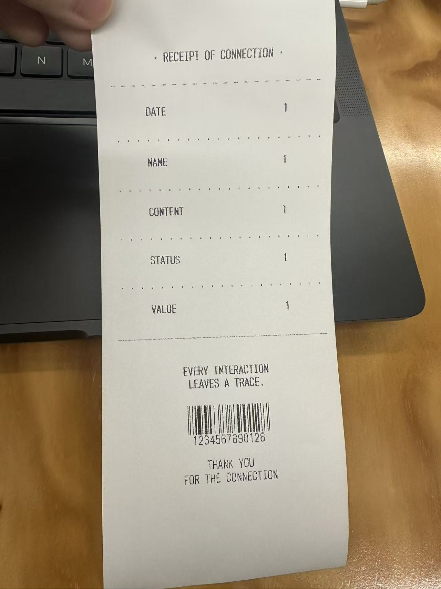

# Week 09

[← Back to Home](../index.md)

## In-Class Activities 

----

### Project Statement: First Draft

#### Case Study

```
Respond to the following:

- What are the data sources used in this work?
- What is the future scenario it addresses?
- What does the statement argue about data and power?
- What might be the intended impact, and is this included in the statement?
```


I think the dataset is the jobs avaliable in America.

The futural scenario it addressed is that AI system will automatically sorting human's job and decide many people's life.

This project is argueing a kind of fairness in the reality and the uneven of the resource to people.

And this could given a concern about AI will be taken over the human.

#### Drafting with NotebookLM

I input my reflective proposal and sketches, also the visual journal from week6-8.

```
CONTEXT: I am a designer developing a data-driven visualisation for public display. The sources provided are from my project journal, documenting experiments, technical learning, conceptual development, and visual research.

TASK: Using only information from these sources, draft a project statement for a general public audience.

The statement must address each of the following:
1. What the visualisation is
2. The data source(s) used
3. The subject matter and future scenario
4. How the work engages critically with ideas about data representation
5. The intended impact on a public audience

FORMAT: Write in first person. Use clear, direct language appropriate for exhibition wall text. Aim for 300 words. Write in continuous prose without headers or bullet points.

IMPORTANT: Draw only from information in the provided sources. If any of the five elements above are unclear or underdeveloped, note this briefly at the end rather than inventing details.
```

And here's the outcome I get.

In my installation, **"Receipts of Relationships,"** I present a speculative data system that transforms social interactions into physical thermal receipts. The work is a physical timeline where fragile, ephemeral slips of paper hang to represent a history of human connection. The data for this project is drawn from my own life over a **four-day period**, during which I recorded **45 meaningful conversations**. Each receipt documents the time, a coded identity for the participant to ensure privacy, the emotional tone of the exchange, and a **quantified value ranging from -10 to 10** based on the interaction’s impact on my mood.

The subject matter explores a **future scenario** where technology, such as biological chips or smart systems, could automatically document human contact as a transaction, with every relationship marked by a systemic "price". This project critically engages with data representation by highlighting how **complex human bonds are often reduced to simplified data points**. By using physical layering and leaving gaps between receipts, I reveal the inherent **uncertainty and subjectivity** found in any dataset. I am questioning what is lost when our most personal moments transition into a system of measurement.

I invite you to move through this installation not just as a viewer, but as an active participant. You are encouraged to **read, touch, and reorder** these fragments of data to reconstruct your own stories from the limited information provided. By using the provided software to generate your own receipt of connection, you can add your own record to this fluid, reconfigurable system. Ultimately, I hope this work prompts you to **reflect on how we record and value our social bonds**, challenging you to look beyond explicit information to find what is "real" in a world of measurements.

#### Evaluation

```
What is working well?
What is missing or underdeveloped?
What feels overly generalised or AI-like?
What do you need to research further?
Write one sentence that commits to the direction of your project.
```

The outcome is looking good for me, but lack with details. It does contain how do I collected the data and what do I want the audience to interact with the installation which is working really well. My idea of important of the true feeling is a bit underdeveloped and this might cause the audience misunderstanding the purpose of the installation. I think the phase it use such as "look beyond explicit information to find what is "real" in a world of measurements." this would be easily simblised as an AI generated content. I think I need to research further on what the emotions will happened while the audience saw this installation or such informations. More on phycology informations. A sentence that commit to the direction of my project will be: The true humanity behinds the mask people wear.

#### Peer Share

My peer have similar feelings as mine, the AI is missing or changing some of the details as it could make mistake on the same resource but on a different timeline. The overall idea is clear to view. All the informations it given out need to be proof read and check before use.

----

### Making Sprint

The issue happening in the Project Statement generation is basically all theory parts, the most urgent task is to improve my programme and make the format of the receipt confirmed.

I communicate with Genmini about my requirments such as make the fonts bigger or keep the text on the same line vertically.

And here's the final design I get for the receipts:



### Round Robin Rapid Reactions

I receive questions mostlly about the meaning of different informations need to be input. And the others all more curious about how do I make the programme and the printer.

And the idea or the message the visitor receive is accrate or similar to what I want them to have, as the final installation with many receipts hanging on the roof, they could not experience the full experience at the moment.

From Tian's suggestion, I need to work more on the programme's aestic, the programme at the time is too simple and lacking in aesthetic appeal.

----

## Independent Study

----

### Project Development

To achieve the suggestion on improve the aesthic of the programme, I give these suggestion to the Genmini and the process is actually harder and more complex then I thought.

I change type in date to select from calendar to the programme. And change from type in the emotions to select one of the emoji provided in the programme.


Here is a typical issue that easilly happened, that due to the different model of device and dark/light mode of the computer, the outcome on the code will be different. Because my device is always on dark mode, so the code need to use the reverse colour to show the informations.


And I asked the AI to add a range of text emoji to replace the type in. This can make the receipts looks more professional and this will not be identify as an image while printing, so the print time is still fast and instant.

----

### Progress Report


