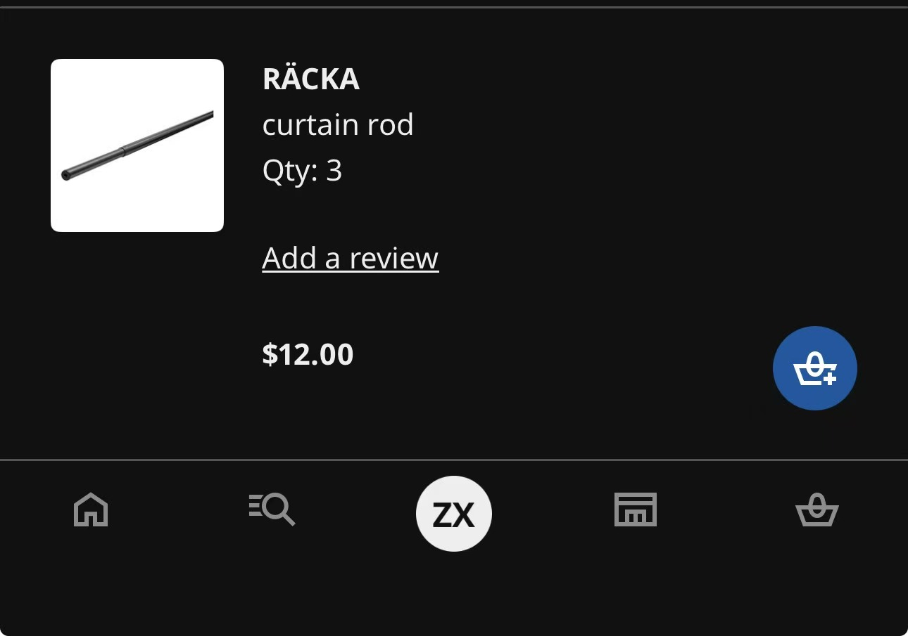
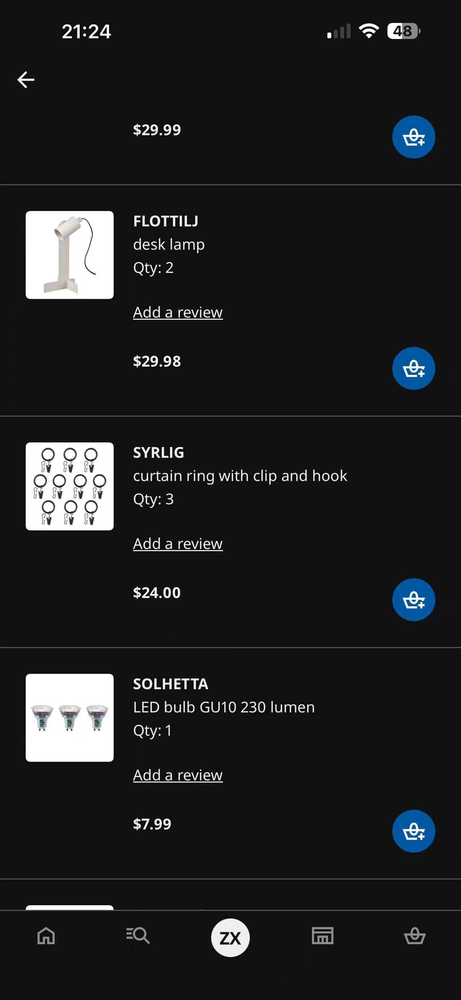

# Week 10

[← Back to Home](../index.md)

## In-Class Activities

----

### Progress Reports

Because I'm so sick on the day, so I have direct conversation with Harrison on WeChat to talk about this project report.

Here's my suggestion for Harrison

And here's the feedback I got from Harrison.

The suggestion on making the project's critical stance  on data collection is a special points that I havn't think or been mentioned before. 

This could hlep my project or idea more criticallly and make the audience to think deeper about the relationships.

----

### Gallery Walk

----

### Action Plan

From the conversation, I received feedback that helped clarify both the conceptual and technical directions of my project. The most significant feedback is focused on the relationship between human emotions and the data. Harrison found the idea of transforming social interactions into receipt-like records engaging and thought-provoking, as it highlights how personal relationships can be reduced to measurable data. This reinforced my intention to use receipts as a metaphor for documenting and valuing human connections.

Another important point was the suggestion to strengthen the project's critical position. Although the installation successfully visualises relationships through data, the audience may not immediately understand whether the project celebrates, questions, or critiques the quantification of social interactions. I realised that I need to make my stance on data collection, surveillance, and emotional measurement more explicit through the installation design and supporting text.

Technically, the feedback confirmed that the combination of hanging receipts and a live receipt-printing system is both achievable and engaging. However, suggested that clearer visual categories be developed to help visitors more easily navigate larger datasets. This highlighted the need for stronger organisation through grouping, symbols, receipt lengths, and emotional indicators.

Based on this feedback, my next steps are to refine the project's narrative and critical message, especially the project statement, and develop a clearer visual categorisation system. I will design an immersive installation using lighting and other external elements, enabling visitors to compare patterns across multiple relationships and interactions. These improvements will help strengthen both the conceptual depth and audience experience of the final exhibition.

----

## Independent Study

----

### Project Development

To improve the settings and prepare for the finasl show case, I go to IKEA for the resouce.

And because of having this I will update my outcome sketch with a full insatllation process.

And I keep working on the programme aesthic and confirm the final outcome and lookings. 

I change the date choose similar to a long selection role, this is because the calendar function will always cause bug appear under weak internet connection.

And I also change the energy value from maunal input to a slidebar which simplfying the explanation for the audience and make the use of the programme smoother.

