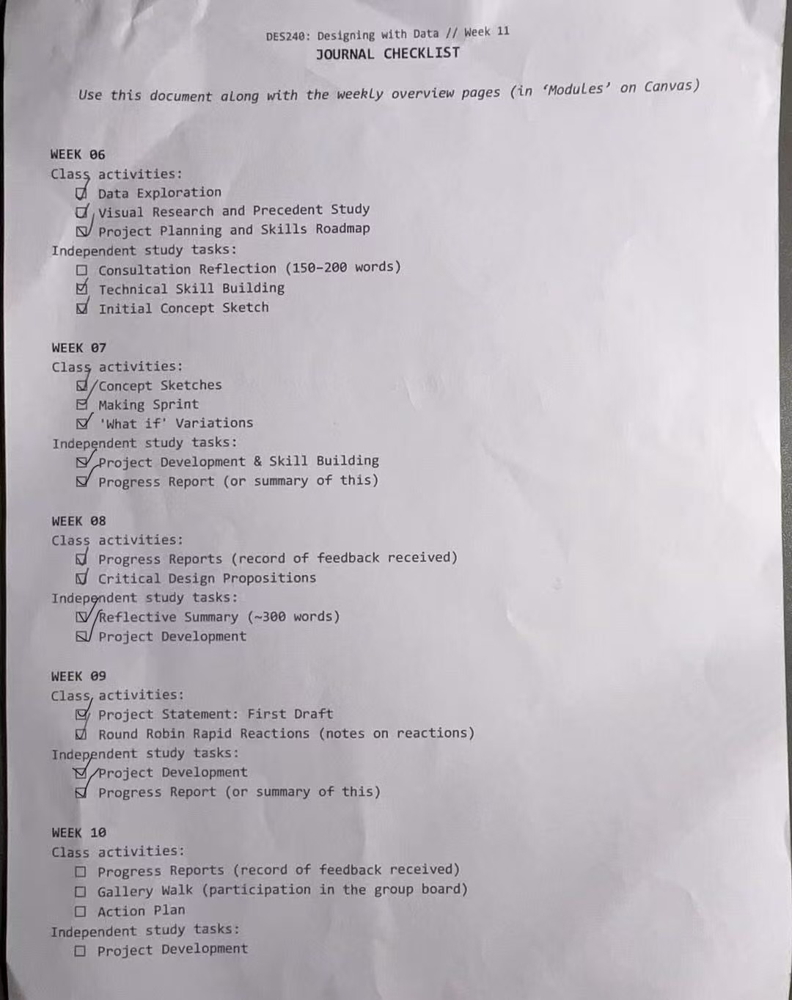
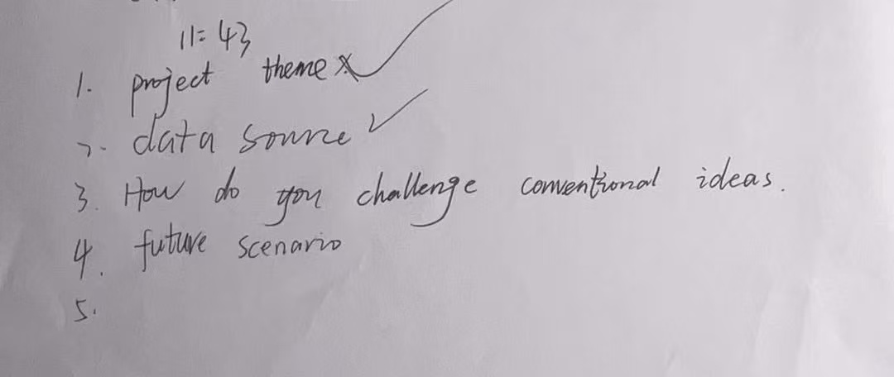
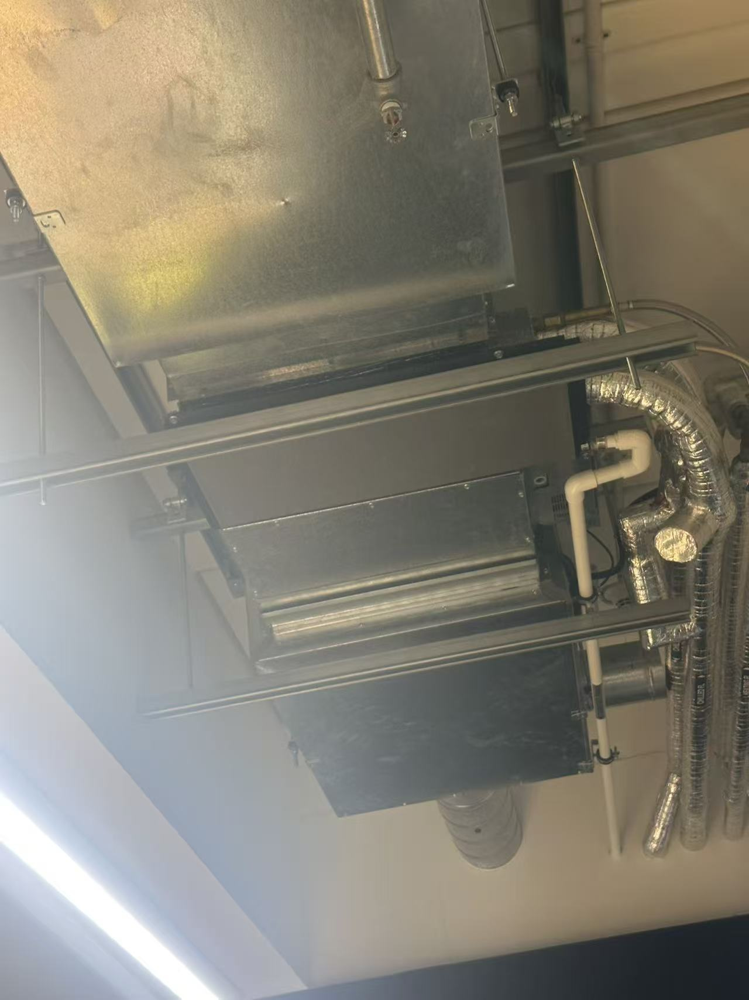
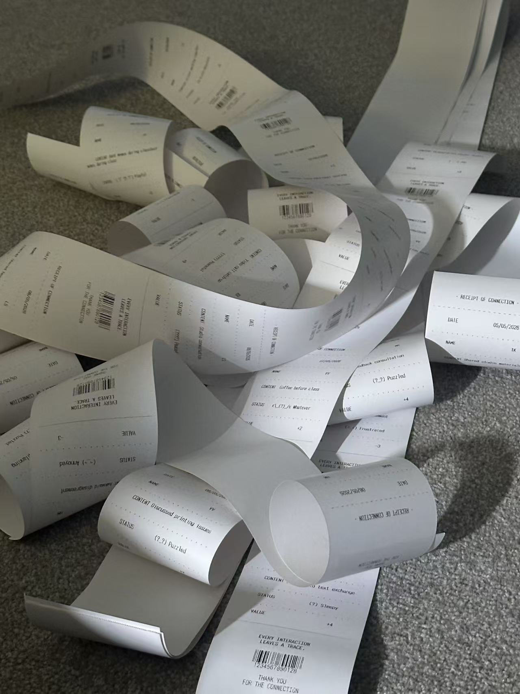

# Week 11

[← Back to Home](../index.md)

## In-Class Activities

----

### Journal Review

I did not finish the week 10 journal yet at this point.

The three key momment that sharpen my project is.

1. Challenges: I need to create a programme and this is the area that I have never touched on. By the help of generative AI, I make the prototype and keep developed to the final outcome.

2. Decisions: The most important decision is I decide to make this as a physical outcome, if this is a screen based project or design, it would not be so interactive and have such visual impact.

3. Feedback: A key feedback is to suggest me have a deeper and more connection with the audience, this made me to think combine the digital and physical outcome together and create a instant printing interaction.

----

### Practice Consultations

I have this practice consultation with Tian. From the feedbacks, I need to working more on how will my project challenege conventional ideas and think more about the future scenarios.

I was not really understand what is conventional ideas before this. It is more like a common sense thing, I'm challenging the trust between the people and the comfort or scape away the mask from visible datas. For the future scenarios, I need to practice more, I do have the idea but is not fluent enough for the consultation.

----

### Showcase Planning

I choose to use one of the meeting room, because it have ability to hang the recepit and tone the environment down for the shwocase.

This is where I can hang the role and it's stable enough.

----

## Independent Study

----

### Project Finalisation and Submission

Start printing for the final exihibition. No demo image because of the installation can only happened on the day.